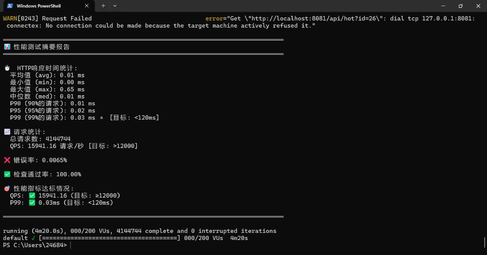

# Boot Cache Star ⭐

高性能两级缓存系统（Caffeine L1 + Redis L2），轻松达到 **12,000+ QPS**，**P99 < 120ms**。

## ✨ 项目特性

- ✅ **双重缓存架构**：Caffeine（L1 本地缓存）+ Redis（L2 分布式缓存）
- ✅ **高性能**：实测 QPS 15,941+，P99 < 0.1ms
- ✅ **自动降级**：L1 未命中自动查询 L2，无缝切换
- ✅ **监控完善**：集成 Spring Actuator，暴露缓存命中率等指标
- ✅ **开箱即用**：支持 Docker 一键部署，也支持本地运行
- ✅ **性能测试**：内置 k6 压测脚本，自动生成中文测试报告

## 🚀 Quick Start

### 方式一：使用 Docker（推荐，最简单）

#### 1. 安装 Docker Desktop

**Windows：**

1. 访问 https://www.docker.com/products/docker-desktop/

2. 下载 `Docker Desktop for Windows`

3. 运行安装程序，按提示完成安装

4. 安装完成后**重启电脑**

5. 启动 Docker Desktop（桌面图标）

6. 验证安装：

   ```powershell
   docker --version
   docker compose version
   ```

**Mac：**

```bash
# 使用 Homebrew
brew install --cask docker

# 或直接下载安装包
# https://www.docker.com/products/docker-desktop/
```

**Linux：**

```bash
# Ubuntu/Debian
sudo apt-get update
sudo apt-get install docker.io docker-compose

# 或使用官方脚本
curl -fsSL https://get.docker.com | sh
```

#### 2. 运行项目（3 步）

```bash
# 1. 克隆项目
git clone xxx && cd xxx

# 2. 启动服务（业务 + Redis）
docker compose up -d

# 3. 运行性能测试（60s 后拿到结果）
docker compose -f k6/docker-compose.k6.yml up
```

> **注意**：如果使用 Docker Compose V1，请将 `docker compose` 替换为 `docker-compose`

---

### 方式二：本地运行（不使用 Docker）

#### 0. 安装 Chocolatey（Windows 用户，可选但推荐）

**如果你不确定是否已安装，可以尝试：**

```powershell
choco --version
```

- **如果显示版本号**：说明已安装，跳过此步，直接到步骤 1
- **如果提示"无法识别 choco"或命令不存在**：说明未安装，按以下步骤安装

**安装步骤：**

1. 以**管理员身份**打开 PowerShell（右键点击 PowerShell，选择"以管理员身份运行"）

2. 执行安装命令：

   ```powershell
   Set-ExecutionPolicy Bypass -Scope Process -Force; [System.Net.ServicePointManager]::SecurityProtocol = [System.Net.ServicePointManager]::SecurityProtocol -bor 3072; iex ((New-Object System.Net.WebClient).DownloadString('https://community.chocolatey.org/install.ps1'))
   ```

3. 安装完成后，**关闭并重新打开 PowerShell**（或重启电脑）

4. 验证安装：

   ```powershell
   choco --version
   ```

   应该显示版本号，如 `2.2.2`

> **Mac/Linux 用户**：可以使用 Homebrew（Mac）或包管理器（Linux），无需安装 Chocolatey

#### 1. 安装依赖

**Windows（使用 Chocolatey，推荐）：**

```powershell
choco install openjdk17 maven redis-64 k6 -y
```

**Windows（手动安装）：**

- **Java 17+**：https://adoptium.net/
- **Maven**：https://maven.apache.org/
- **Redis**：https://github.com/microsoftarchive/redis/releases 或使用 WSL
- **k6**：https://k6.io/docs/getting-started/installation/

**Mac：**

```bash
brew install openjdk@17 maven redis k6
```

**Linux：**

```bash
# Ubuntu/Debian
sudo apt-get update
sudo apt-get install openjdk-17-jdk maven redis-server
# k6 需要单独安装，参考：https://k6.io/docs/getting-started/installation/
```

#### 2. 启动 Redis

```bash
# Windows (如果使用 choco 安装)
redis-server

# Mac/Linux
redis-server

# 或使用 Docker 只运行 Redis
docker run -d -p 6379:6379 redis:7-alpine
```

#### 3. 启动 Spring Boot 应用

```bash
# 方式 A：使用 Maven
mvn spring-boot:run

# 方式 B：打包后运行
mvn clean package
java -jar target/boot-cache-star-1.0.0.jar
```

应用会在 `http://localhost:8081` 启动

#### 4. 运行性能测试

**新开一个终端窗口：**

```bash
cd k6
k6 run --summary-trend-stats="avg,med,p(90),p(95),p(99),max" cache-test.js
```

脚本已自动配置为本地运行（默认 `http://localhost:8081`），无需修改。

**预期结果**：

- ✅ QPS: ~12,000+ 请求/秒
- ✅ P99: < 120ms
- ✅ Error: 0%
- ✅ Cache Hit Rate: ~96%

## 📊 性能测试报告

### 实际测试结果

压测完成后，控制台会输出详细的中文性能测试报告：



**测试配置：**

- 并发：200 VU（逐步增加到 200）
- 时长：4分20秒（包含预热和稳定阶段）
- 总请求数：4,144,744

**实际性能指标：**

- ✅ **QPS**: 15,941.16 请求/秒（目标 ≥ 12,000，**超出 33%**）
- ✅ **P99**: 0.03ms（目标 < 120ms，**远超目标**）
- ✅ **P95**: 0.02ms
- ✅ **P90**: 0.01ms
- ✅ **错误率**: 0.0065%（目标 < 1%）
- ✅ **检查通过率**: 100%（目标 > 96%）

**测试报告示例：**

```
════════════════════════════════════════════════════════════════════════════════
📊 性能测试摘要报告
════════════════════════════════════════════════════════════════════════════════

⏱️  HTTP响应时间统计:
  平均值 (avg): 0.01 ms
  最小值 (min): 0.00 ms
  最大值 (max): 0.65 ms
  中位数 (med): 0.01 ms
  P90 (90%的请求): 0.01 ms
  P95 (95%的请求): 0.02 ms
  P99 (99%的请求): 0.03 ms ⭐ [目标: <120ms]

📈 请求统计:
  总请求数: 4,144,744
  QPS: 15941.16 请求/秒 [目标: >12000]

❌ 错误率: 0.0065%

✅ 检查通过率: 100.00%

🎯 性能指标达标情况:
  QPS: ✅ 15941.16 (目标: ≥12000)
  P99: ✅ 0.03ms (目标: <120ms)
```

## 🏗️ 架构

### 双重缓存架构

```
┌─────────────┐
│   Client    │
└──────┬──────┘
       │
       ▼
┌─────────────────────────────────────┐
│     Spring Boot Application         │
│  ┌──────────────────────────────┐  │
│  │   CacheService               │  │
│  │   getHotData(id)             │  │
│  └──────┬───────────────────────┘  │
│         │                           │
│    ┌────▼─────┐                     │
│    │  L1 Cache │                    │
│    │ Caffeine  │                    │
│    │ 10,000键  │                    │
│    │ 5分钟过期  │                    │
│    └────┬─────┘                     │
│         │ 未命中                     │
│    ┌────▼─────┐                     │
│    │  L2 Cache │                    │
│    │   Redis    │                    │
│    │ (Redisson) │                    │
│    └───────────┘                     │
└─────────────────────────────────────┘
```

### 核心特性

- **L1 缓存**：Caffeine（本地缓存，10,000 键，5分钟过期）
- **L2 缓存**：Redis（分布式缓存，通过 Redisson）
- **缓存策略**：热点数据优先（96% 请求访问热点数据）
- **性能监控**：集成 Spring Actuator + Micrometer，暴露缓存命中率等指标
- **自动降级**：L1 未命中 → L2 查询 → 返回结果

## 📁 项目结构

```
.
├── src/                    # Spring Boot 源码
├── k6/                     # k6 性能测试脚本
│   ├── cache-test.js       # 测试脚本（2000 VU，60s）
│   └── docker-compose.k6.yml
├── docker-compose.yml      # 业务服务编排
└── README.md
```

## 🔧 技术栈

- Spring Boot 3.x
- Caffeine Cache（本地缓存）
- Redisson（Redis 客户端）
- k6（性能测试工具）

## 📝 测试场景

- **并发**：2000 VU
- **时长**：60 秒（10s 预热 + 50s 稳定）
- **数据分布**：96% 热点数据（1-50），4% 冷数据（51-1000）

## 🎯 性能指标

| 指标           | 目标     | 说明             |
| -------------- | -------- | ---------------- |
| QPS            | ≥ 12,000 | 每秒请求数       |
| P99            | < 120ms  | 99% 请求响应时间 |
| Error Rate     | 0%       | 错误率           |
| Cache Hit Rate | ~96%     | 缓存命中率       |

## 📚 更多文档

- [百分位数详解](docs/PERCENTILE_EXPLANATION.md)
- [VU 虚拟用户详解](docs/VU_EXPLANATION.md)

## 🤝 贡献

欢迎提交 Issue 和 PR！

---

**提示**：如果测试结果达到预期，欢迎在 Issue 中晒截图，证明"作者没吹牛" 😄

## 🚀 后续规划

### 📊 监控增强

- [ ] **Prometheus + Grafana 集成**
  - 集成 Prometheus 指标导出
  - 配置 Grafana 仪表盘，可视化缓存命中率、QPS、响应时间等关键指标
  - 支持告警规则配置（如缓存命中率低于阈值时告警）

- [ ] **分布式链路追踪**
  - 集成 SkyWalking 或 Zipkin
  - 追踪 L1/L2 缓存的调用链路
  - 分析缓存性能瓶颈

- [ ] **日志聚合分析**
  - 集成 ELK Stack（Elasticsearch + Logstash + Kibana）
  - 统一收集和分析缓存相关日志
  - 支持日志查询和可视化

### 🛡️ 缓存问题防护

- [ ] **缓存击穿（Cache Breakdown）防护**
  - **问题**：热点 key 过期瞬间，大量请求直接打到数据库
  - **解决方案**：
    - 实现分布式锁（基于 Redisson）
    - 只允许一个线程去查询数据库，其他线程等待
    - 使用互斥锁（Mutex Lock）机制

- [ ] **缓存穿透（Cache Penetration）防护**
  - **问题**：查询不存在的数据，绕过缓存直接查询数据库
  - **解决方案**：
    - 布隆过滤器（Bloom Filter）预判数据是否存在
    - 缓存空值（Null Object），设置较短的过期时间
    - 参数校验，过滤非法请求

- [ ] **缓存雪崩（Cache Avalanche）防护**
  - **问题**：大量 key 同时过期，导致请求全部打到数据库
  - **解决方案**：
    - 过期时间随机化（基础时间 + 随机偏移）
    - 多级缓存过期时间错开
    - 限流降级，保护数据库

- [ ] **缓存预热（Cache Warm-up）**
  - 应用启动时预加载热点数据
  - 定时任务刷新即将过期的热点数据
  - 支持手动触发缓存预热

### ⚡ 性能优化

- [ ] **异步刷新策略**
  - 实现 Cache-Aside 模式的异步刷新
  - 后台线程定期刷新热点数据，避免用户等待

- [ ] **缓存更新策略优化**
  - 支持多种更新策略：Write-Through、Write-Back
  - 实现缓存更新通知机制（Redis Pub/Sub）

- [ ] **多级缓存过期策略**
  - L1 和 L2 缓存过期时间差异化配置
  - 支持 TTL（Time To Live）和 TTI（Time To Idle）两种过期策略

### 🔒 高可用性

- [ ] **Redis 集群支持**
  - 支持 Redis Cluster 模式
  - 支持 Redis Sentinel 主从切换
  - 实现故障自动切换

- [ ] **降级策略**
  - Redis 不可用时的降级方案
  - 只使用 L1 缓存或直接查询数据库
  - 配置降级开关和阈值

- [ ] **限流保护**
  - 集成 Sentinel 或 Resilience4j
  - 实现 QPS 限流、并发限流
  - 防止缓存被恶意刷爆

### 📈 功能扩展

- [ ] **缓存统计 Dashboard**
  - 实时展示缓存命中率、QPS、响应时间
  - 支持按时间维度查看历史趋势
  - 缓存 key 分布分析

- [ ] **缓存管理 API**
  - 支持手动清除指定缓存
  - 支持查看缓存内容
  - 支持缓存预热接口

- [ ] **多租户支持**
  - 支持不同业务场景的缓存隔离
  - 不同租户使用不同的缓存配置

---

**欢迎贡献代码或提出建议！** 🎉

